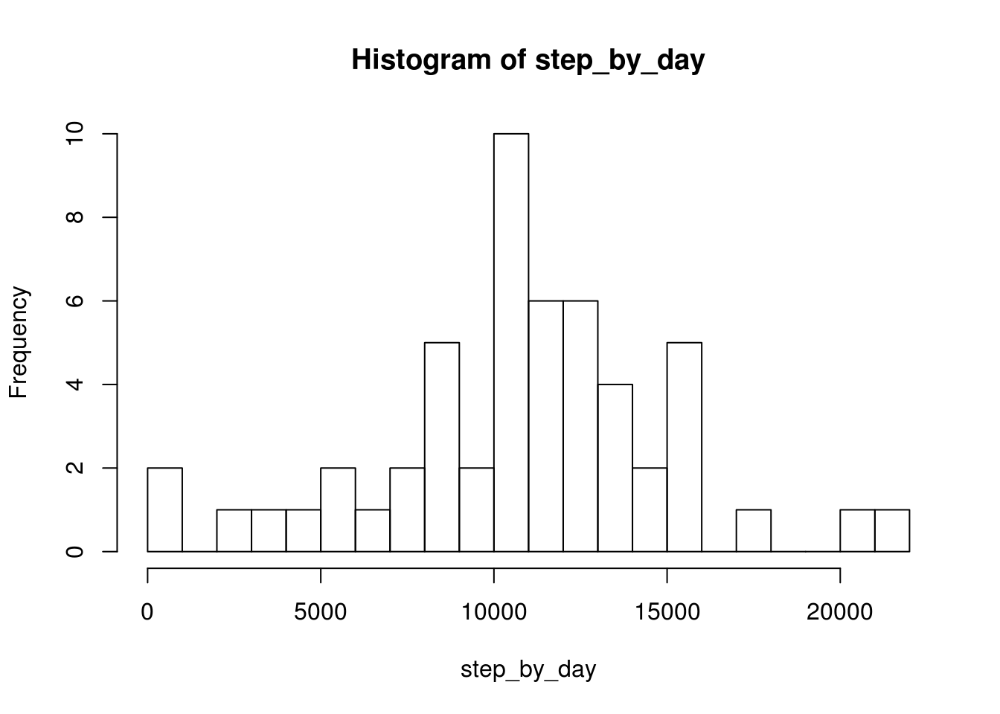
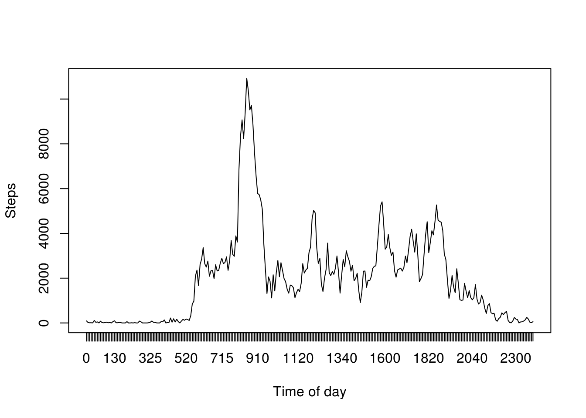
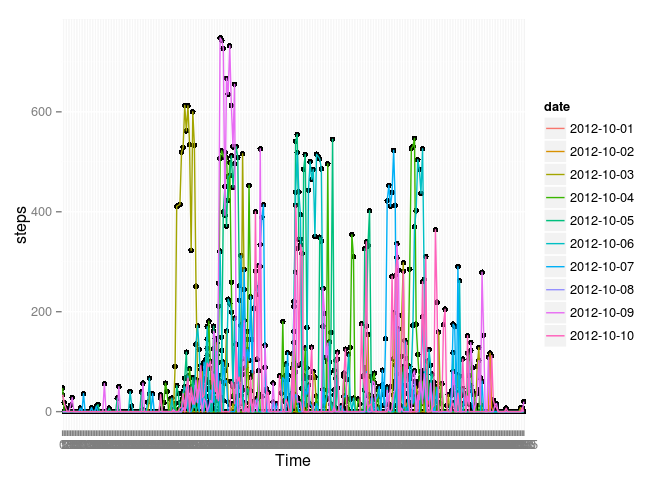
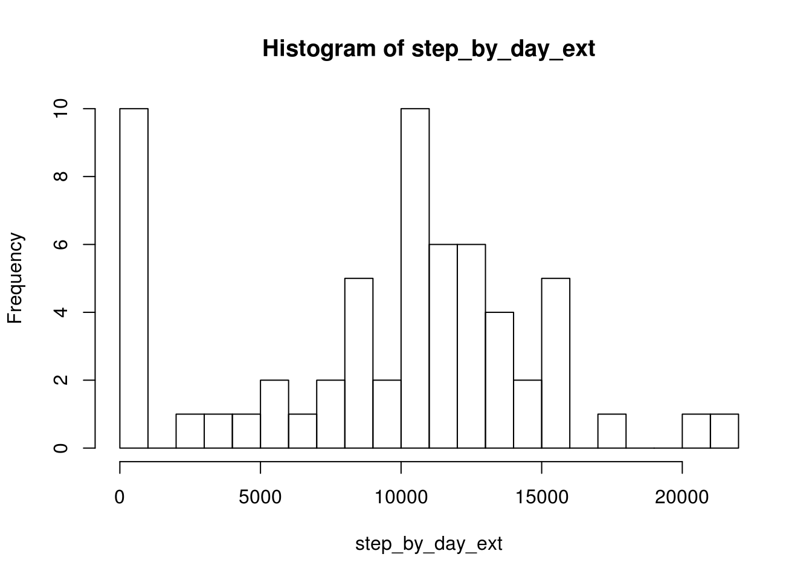
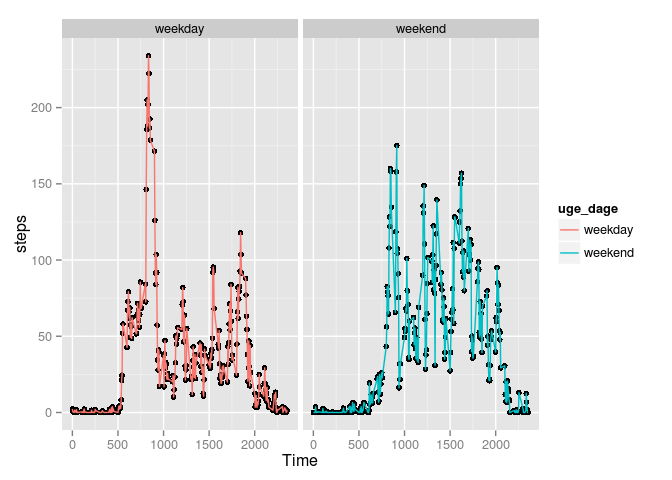

#Reproducible Research
##Assignment 1

**Loading and preprocessing the data**  
1 Loading data from working directory  


```r
act_data<-read.csv('activity.csv')
head(act_data)
```

```
##   steps       date interval
## 1    NA 2012-10-01        0
## 2    NA 2012-10-01        5
## 3    NA 2012-10-01       10
## 4    NA 2012-10-01       15
## 5    NA 2012-10-01       20
## 6    NA 2012-10-01       25
```

2 No formatting of data needed at this point

**What is mean total number of steps taken per day?**    
1 Number of steps summed for each date in variable step_by_day  

```r
step_by_day <-tapply(act_data$steps, act_data$date, sum)
```

2 Number of steps per day plotted in a histogram:  

```r
hist(step_by_day, breaks = 20)
```

 
      
3 Calculate the mean and the median of the amount of steps per day         

```r
median(step_by_day,na.rm=TRUE)
```

```
## [1] 10765
```

```r
mean(step_by_day, na.rm=TRUE)
```

```
## [1] 10766.19
```
Mean number of steps per day is 10766,19 steps, median of the dataset is 10765

**What is the average daily activity pattern?**  
1 Number of steps taken in each interval summed for all dates  


```r
step_by_interval <-tapply(act_data$steps, act_data$interval, sum, na.rm = TRUE)
summary(step_by_interval)
```

```
##    Min. 1st Qu.  Median    Mean 3rd Qu.    Max. 
##     0.0   131.8  1808.0  1981.0  2800.0 10930.0
```
2 Number of steps taken in each interval shown in a plot. 

```r
plot(step_by_interval, xaxt="n" , type = "l", xlab = "Time of day", ylab = "Steps")
axis(1,at=1:288,labels=names(step_by_interval))
```

 

3 The time interval (time of the day) that contains the highest number of steps (summed for all dates)

```r
names(which.max(step_by_interval))
```

```
## [1] "835"
```
which is the time interval starting at 8:35 being the one with the highest number of steps.

**Imputing missing values**  
1 Calculating total number of missing values

```r
sum(is.na(act_data[]))
```

```
## [1] 2304
```
there are 2304 missing values in the activity dataset  

2 To find out how to replace the missing number I made a plot of the first 10 days in the dataset  

```r
library(ggplot2)
ggplot(data = act_data[1:2880,], aes(x = as.factor(interval), y = steps)) + 
        geom_point()+ 
        geom_line(aes(colour=date, group=date)) + 
        xlab("Time")
```

```
## Warning: Removed 576 rows containing missing values (geom_point).
```

 

As there are only few lonely spikes (datapoints lying far away from its neighbours), it seems resonable to fit the missing values with the value from previous interval 

3 Creating dataset act_data_ext, by copying the act_data and replacing any missing values with its previous value


```r
library(zoo)
```


```r
act_data_ext<-act_data
act_data_ext$steps[1]<-0 
act_data_ext$steps <- na.locf(act_data_ext$steps)
```

4 Number of steps summed for each date in variable step_by_day  

```r
step_by_day_ext <-tapply(act_data_ext$steps, act_data_ext$date, sum)
```

Now let's look at the summary and histogram, to see how the imputed data affected the dataset


```r
hist(step_by_day_ext, breaks = 20)
```

 

```r
summary(step_by_day_ext)
```

```
##    Min. 1st Qu.  Median    Mean 3rd Qu.    Max. 
##       0    6778   10400    9354   12810   21190
```
      

In the dataset with replacemet values for the missing values the mean is 9354 steps and the median is 10400. Replacing the NA's by this stategy made the mean and median drop, since many zeros were added. The histogram shows that 10 days have less than 1000 steps (in the original dataset only 2 days had 0-1000 steps).  

**Are there differences in activity patterns between weekdays and weekends?**  
1.adding a colomn to the act_data dataframe, with a factor "weekday" or "weekend"


```r
uge_dage <- factor(ifelse(((weekdays(as.Date(act_data$date)) == "Saturday")|(weekdays(as.Date(act_data$date)) == "Sunday")),"weekend", "weekday"))
act_days<-cbind(act_data,uge_dage)
```

which made the dataframe look like this 


```r
head(act_days)
```

```
##   steps       date interval uge_dage
## 1    NA 2012-10-01        0  weekday
## 2    NA 2012-10-01        5  weekday
## 3    NA 2012-10-01       10  weekday
## 4    NA 2012-10-01       15  weekday
## 5    NA 2012-10-01       20  weekday
## 6    NA 2012-10-01       25  weekday
```

Calculating average of the weekdays ans weekends for each time interval and plotting these


```r
mean_wds_wend <-aggregate(steps ~ interval + uge_dage, data = act_days, FUN= "mean" )
ggplot(data = mean_wds_wend, aes(x= interval, y=steps)) + 
        geom_point() +
        geom_line((aes(colour=uge_dage, group=uge_dage))) +
        xlab("Time") +
        facet_wrap(~uge_dage)
```

 

Weekdays have the higest mean of steps in the intervals lying between approximately 5:15 and 9:30, after that time of day the mean of the weekends lie above the weekdays excpept for a peak on weekdays around 18.00

